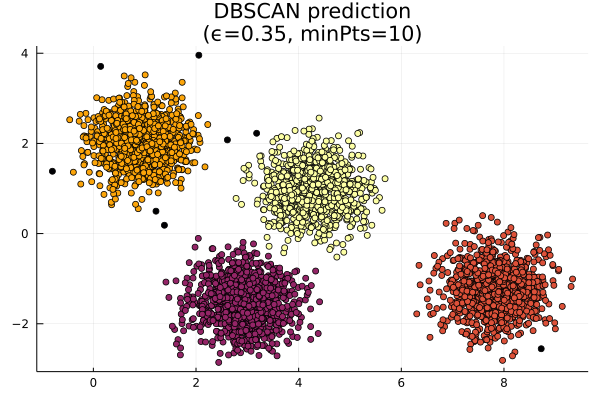

# ClusterAnalysis.jl

[](https://AugustoCL.github.io/ClusterAnalysis.jl/stable)
[](https://AugustoCL.github.io/ClusterAnalysis.jl/dev)
[](https://github.com/AugustoCL/ClusterAnalysis.jl/actions)
[](https://codecov.io/gh/AugustoCL/ClusterAnalysis.jl)


  

This package was <ins>**built from scratch**</ins>, entirely in [Julia Lang](https://julialang.org/), and implements a few popular clustering algorithms like K-Means and DBSCAN. 

This is mostly a learning experiment, but the package were also built and documented to be used by anyone, Plug-and-Play. Just input your data as an Array or a [Tables.jl](https://discourse.julialang.org/t/tables-jl-a-table-interface-for-everyone/14071) type (like [DataFrames.jl](https://dataframes.juliadata.org/stable/)), then start training your clusters algorithms and analyze your results. 

Documentation: [https://augustocl.github.io/ClusterAnalysis.jl/](https://augustocl.github.io/ClusterAnalysis.jl/)

## Algorithms Implemented
Currently we implemented two types of algorithms, a partitioned based ([K-Means](https://en.wikipedia.org/wiki/K-means_clustering)) and a spatial density based ([DBSCAN](https://en.wikipedia.org/wiki/DBSCAN)). 

> Go check the `Algorithms Overview` Section that contains all the details of how it works the algorithm and also got the bibliography and papers used during the research and development of the code.

>It's a great introduction to the algorithm and a good resource to read along with the source code.

- [DBSCAN](https://augustocl.github.io/ClusterAnalysis.jl/dev/algorithms/dbscan.html)
- [K-Means](https://augustocl.github.io/ClusterAnalysis.jl/dev/algorithms/kmeans.html)

## How to install ClusterAnalysis.jl

```julia
# press ] to enter in Pkg REPL mode.
julia> ]
pkg> add ClusterAnalysis
```  

## To-Do
- [X] Add K-Means++ initialization, to go beyond the random initialization proposed by Andrew NG. DONE
- [X] Create DBSCAN algorithm. DONE
- [ ] Create Hierarchical clustering algorithms with single, complete and average linkage options.
