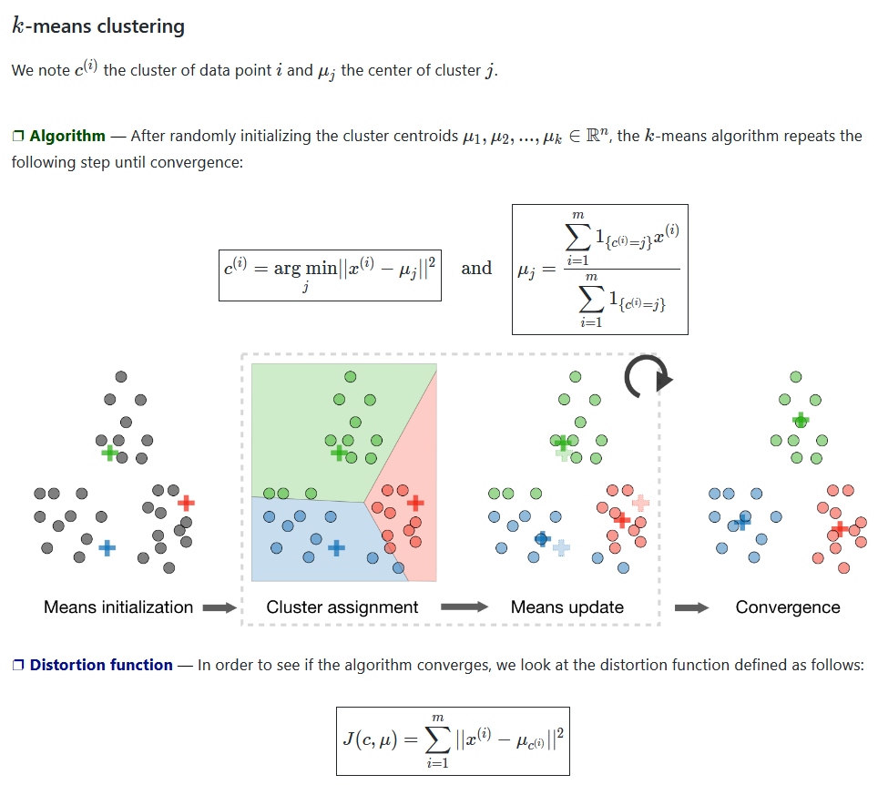
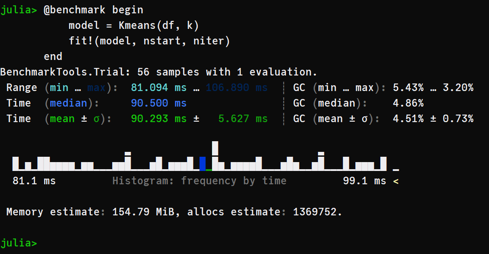

# ClusterAnalysis.jl

This package was built from scratch, entirely in [Julia Lang](julialang.org/), and implements (until now) the [K-Means](https://en.wikipedia.org/wiki/K-means_clustering) cluster algorithm. 

This is mostly a learning experiment, but the functions were built and documented to be used by anyone (Plug-and-Play). Just input your data as an Array or a Tables.jl type (like DataFrames), then start fit!() and analyze your results. 

We were inspired by reading some articles (in the references) and watching [Andrew NG lectures](https://www.youtube.com/watch?v=hDmNF9JG3lo) and [StatQuest](https://www.youtube.com/watch?v=4b5d3muPQmA) videos about K-Means. Then, we start prototype the pseudo-code in Julia, which result in this package.


## Cool vizualizations that explain the K-Means algorithm


**Figure 01** - From [Stanford ML CheatSheet](https://stanford.edu/~shervine/teaching/cs-229/cheatsheet-unsupervised-learning#clustering) 


  

**Figure 02** - From [K-Means wikipedia page](https://en.wikipedia.org/wiki/K-means_clustering#/media/File:K-means_convergence.gif)

## Benchmarking code
```julia
julia> using ClusterAnalysis

# load iris dataset 
julia> iris = dataset("datasets", "iris");
julia> df = Matrix{Float64}(iris[:,1:end-1]);

# parameters of k-means
julia> k, nstart, niter = 4, 100, 10;

# benchmarking algorithm
julia> @benchmark begin
            model = Kmeans(df, k)
            fit!(model, nstart, niter)    
        end
```
  


## References and Papers
- [First paper](http://projecteuclid.org/euclid.bsmsp/1200512992) that mentioned K-Means.
- [Pseudo-Code](http://www.inference.org.uk/mackay/itprnn/ps/284.292.pdf) utilized to prototype the first code extracted from the book *Information Theory, Inference and Learning Algorithms*.
- [K-Means++](http://ilpubs.stanford.edu:8090/778/1/2006-13.pdf) paper with the new initialization that ww are going to add soon.
- [Stanford Slides](http://theory.stanford.edu/~sergei/slides/BATS-Means.pdf) about K-Means.


## TO-DO
- [ ] Add K-Means++ initialization, because today we got only the random initialization proposed by Andrew NG.
- [ ] Create Hierarchical clustering algorithms with single. complete and average linkage options.
- [ ] Create DBSCAN algorithm.
