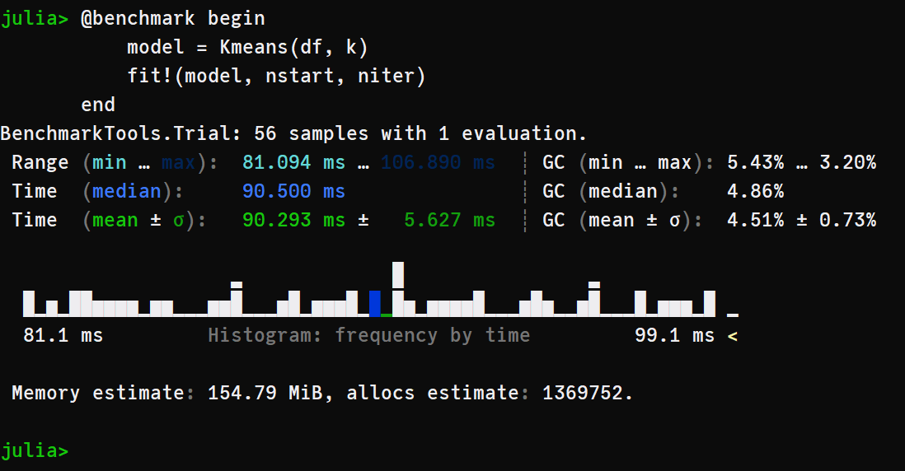

## Overview of K-Means and Code

  

It's a [cluster algorithm](https://en.wikipedia.org/wiki/Cluster_analysis#cluster) based on [centroids](https://en.wikipedia.org/wiki/Centroid). The method partitions the data into k clusters, where each observation belongs to a cluster/centroid . The user needs to provide the number of k cluster desired and to choose the ideal number os k, there are some methods such the [elbow-plot](https://en.wikipedia.org/wiki/Elbow_method_(clustering)) or the [silhuete-plot](https://en.wikipedia.org/wiki/Silhouette_(clustering)) that could be implemented with this package.  

The K-Means is a iterative method, therefore it optimizes the measure of intra-cluster variance through a sequence of iterations detailed below. There is a equivalence between the sum of squared error (SSE) and the total intra-cluster variance, Kriegel (2016), which allows us optimize the SSE in the code.

The inspiration for K-Means came from reading some articles (in the references) and watching [Andrew NG lectures](https://www.youtube.com/watch?v=hDmNF9JG3lo) and [StatQuest](https://www.youtube.com/watch?v=4b5d3muPQmA) videos about it. Then, we start prototype the pseudo-code in Julia, which result in this package.

## Pseudocode
1. Random initialize k centroids.
2. Calculate the distance of every point to every centroid.
3. Assign every point to a cluster, by choosing the centroid with the minimum distance to the point.
4. Calculate the Total Variance Within Cluster by the SSE of this iteration.
5. Recalculate the centroids using the mean of the assigned points.
6. Repeat the steps 3 to 5, `maxiter` times, until reach at the minimum total variance at step 4.

After that, repeat all steps `nstart` times and select the centroids with the minimum total variance.

The default arguments `nstart` and `maxiter` in the code are 10 and 10, respectively. But could also be changed by the user changing the args in the function `kmeans(data, K, nstart=10, maxiter=10)`, for example.


## Cool vizualizations that explain the K-Means algorithm
**Figure 01** - From [Stanford ML CheatSheet](https://stanford.edu/~shervine/teaching/cs-229/cheatsheet-unsupervised-learning#clustering)  


**Figure 02** - From [K-Means wikipedia page](https://en.wikipedia.org/wiki/K-means_clustering#/media/File:K-means_convergence.gif)  
  

## Benchmarking the algorithm
```julia
# install and load packages
pkg> add "https://github.com/AugustoCL/ClusterAnalysis.jl"
julia> using ClusterAnalysis, RDatasets, DataFrames

# load iris dataset 
julia> iris = dataset("datasets", "iris");
julia> df = iris[:, 1:end-1];

# parameters of k-means
julia> k, nstart, maxiter = 4, 10, 10;

# benchmarking the algorithm
julia> @benchmark model = kmeans($df, $k, nstart=$nstart, maxiter=$maxiter)
```  
  

This implementation has an excellent computational performance, being faster than [Scikit-Learn's KMeans](https://scikit-learn.org/stable/modules/generated/sklearn.cluster.KMeans.html#sklearn.cluster.KMeans) and very close to the [kmeans from R](https://www.rdocumentation.org/packages/stats/versions/3.6.2/topics/kmeans), which call C and FORTRAN in its source code.

**Scikit-Learn with C in backend**

  

**R with C + FORTRAN in backend**

   

Machine settings used in benchmarking  
**Processor**: Intel(R) Core(TM) i5-7200U CPU @ 2.50GHz   2.71 GHz  
**RAM**: 8,00 GB   

## References and Papers
- [First paper](http://projecteuclid.org/euclid.bsmsp/1200512992) that mentioned K-Means.
- [Pseudo-Code](http://www.inference.org.uk/mackay/itprnn/ps/284.292.pdf) utilized to prototype the first code extracted from the book *Information Theory, Inference and Learning Algorithms*.
- [K-Means++](http://ilpubs.stanford.edu:8090/778/1/2006-13.pdf) paper with the KMeans++  initialization that we will add soon.
- [Stanford Slides](http://theory.stanford.edu/~sergei/slides/BATS-Means.pdf) about K-Means.
- Kriegel, Hans-Peter; Schubert, Erich; Zimek, Arthur (2016). "The (black) art of runtime evaluation: Are we comparing algorithms or implementations?". 

## K-Means Struct
```julia
# kmeans output struct
struct KmeansResult{T<:Real}
    K::Int
    centroids::Vector{Vector{T}}
    cluster::Vector{Int}
    withinss::T
    iter::Int
end
```

## TO-DO
- [ ] Add K-Means++ initialization. Until now we got only the random initialization proposed by Andrew NG.
