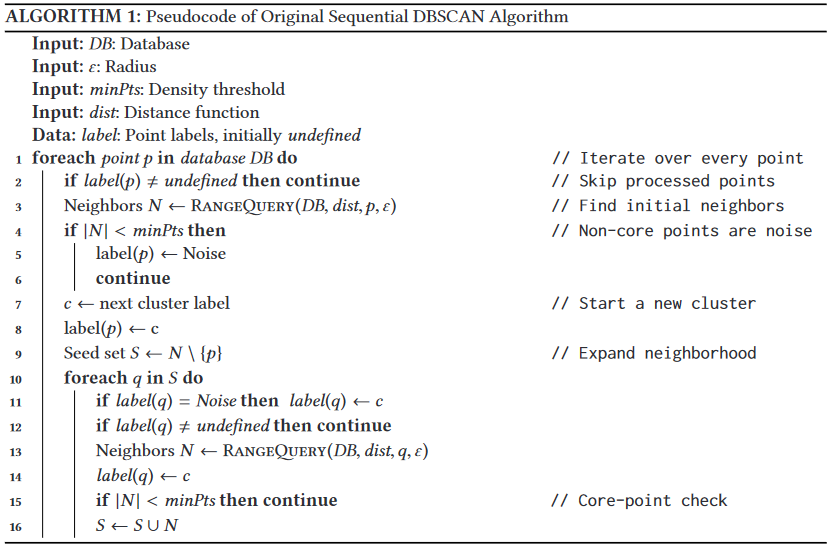

## Overview of DBSCAN
[DBSCAN](https://en.wikipedia.org/wiki/DBSCAN) it's a specific clustering algorithm, very apropriated to spatial data. It's a non-parametric method that apply the concept of density, which beyond identify clusters, it's also able to recognize noise observations. Thus, all those ideas it's inside their name, Density Based Spatial Clustering of Application with Noise (DBSCAN), which classifies it as a density-based clustering non-parametric algorithm. 

In a certain way, the algorith try mimic the human hability of recognize groups of points which are close to each other and points which are distant be considered out of the group. 

**Figure 01** - Spatial Data example from the [First Paper](https://www.aaai.org/Papers/KDD/1996/KDD96-037.pdf) of DBSCAN  
```@raw html

```

This way we could identify points inside a density/cluster and points which isn't in any density cluster, called noises.

The user choose the hyperparameters `min_points` and `ϵ`, which correspond to the minimum points necessary for a observation be considered a core-point and the radius which every point will calculate the other points who surround them, respectively.

### Logic of DBSCAN
The algorithm uses two important data structures in your code structure:
- [FIFO](https://en.wikipedia.org/wiki/FIFO_(computing_and_electronics)) queue  
To keep track of the points which are already labelled.
- [KDTree](https://en.wikipedia.org/wiki/K-d_tree) (binary tree)  
Used to make the continuous search of density points in a tree structure. That search feed and use the FIFO queue and this structure make the code be very performatic by using the KDTree struct  from [NearestNeighbors.jl](https://github.com/KristofferC/NearestNeighbors.jl/) package.   

The algorithm sets as a `core-point` , points which has more than `min_points` neighbours within this radius `ϵ`. All the points inside this radius distance it's part of the same cluster (same density). Points with less than `min_points` neighbours could be labelled as: 
- Noise  
Because doesn't touchs any point already labelled as cluster.
- Border point  
Because touchs at least one labelled point, which will also be labelled as the point touched.   

> The distance used in this implementation to calculate the point's neighbours is the [euclidian distance](https://en.wikipedia.org/wiki/Euclidean_distance). In the code, this search for neighbors it's refered as the RangeQuery function and that function it's the most crucial part of the algorithm in question of performancing. Because of that search we incorporate the KDTree structure, cited before, already implemented in `NearestNeighbours.jl`.

**Figure 02** - Ilustration of DBSCAN from [this Paper](https://www.ccs.neu.edu/home/vip/teach/DMcourse/2_cluster_EM_mixt/notes_slides/revisitofrevisitDBSCAN.pdf)  
```@raw html

```

## Pseudocode
We got inspired by this pseudo-code presented in the Paper "[DBSCAN Revisited](https://www.ccs.neu.edu/home/vip/teach/DMcourse/2_cluster_EM_mixt/notes_slides/revisitofrevisitDBSCAN.pdf)". Here, the reader could get a overview of the steps of the code.

```@raw html

```

## A cool visualization that explain the algorithm
Now, I need to share with the world this amazing website created by [Naftali Harris](https://www.naftaliharris.com/), from this detailed [post](https://www.naftaliharris.com/blog/visualizing-dbscan-clustering/) about DBSCAN. I crop a gif from this interactive visualization because this way I hope would be easier for the reader connect all the information broughted above.  


## Benchmarking code
```julia
using ClusterAnalysis, DataFrames, CSV, BenchmarkTools

# load blob dataset 
df = CSV.read("algo_overview/blob_data.csv", DataFrame, drop=[1]);
X = df[:,1:2];
y = df[:,end];

# parameters of k-means
ϵ = 0.35;
min_pts = 10;

# benchmarking algorithm
@benchmark m = dbscan(X, ϵ, min_pts)
``` 
```@raw html
  
```
  
**Scikit-Learn with C in backend**
```@raw html
  
```

**R with C++ in backend**
```@raw html
   
```

Machine settings used in benchmarking  
**Processor**: Intel(R) Core(TM) i5-7200U CPU @ 2.50GHz   2.71 GHz  
**RAM**: 8,00 GB 


## DBSCAN Results
```julia
using Plots, StatsPlots

m = dbscan(X, ϵ, min_pts);

scatter(X[:,1], X[:,2], zcolor=m.labels, 
        leg=false, 
        title="DBSCAN prediction\n(ϵ=$(ϵ), minPts=$(min_pts))")
```
```@raw html
  
```

## DBSCAN Struct
```julia
struct DBSCAN{T<:AbstractFloat, KD<:KDTree}
    df::Matrix{T}
    ϵ::T
    min_pts::Int
    labels::Vector{Int}
    tree::KD
    clusters::Vector{Vector{Int}}

    # Internal Constructor
    function DBSCAN(df::Matrix{T}, ϵ::T, min_pts::Int) where {T<:AbstractFloat} 
        labels = fill(-1, size(df,1))
        tree = KDTree(df', leafsize=20)
        clusters = Vector{Vector{Int}}()
        KD = typeof(tree)

        new{T, KD}(df, ϵ, min_pts, labels, tree, clusters)
    end
end
```

## References and Papers
- [First Paper](https://www.aaai.org/Papers/KDD/1996/KDD96-037.pdf) of DBSCAN.
- [DBSCAN Revisited: Why and How You Should (Still) Use DBSCAN](https://www.ccs.neu.edu/home/vip/teach/DMcourse/2_cluster_EM_mixt/notes_slides/revisitofrevisitDBSCAN.pdf).
